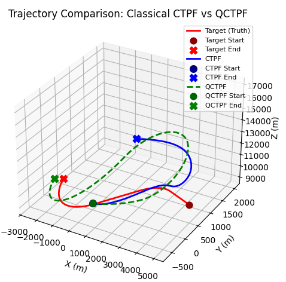
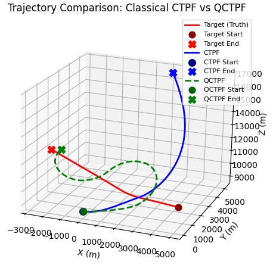
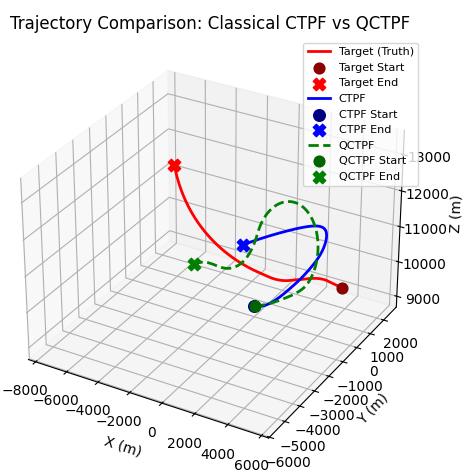

# ⚛️ QCTPF — Quantum-Classical Missile Guidance System
### *Teaching qubits to hunt supersonic jets*

---

> **"What if instead of writing a better guidance law, we just... evolved one using quantum circuits?"**
> — This project, probably

---

## 🚀 What Is This?

This is a **quantum-neuroevolutionary missile guidance system** that uses a Qiskit-simulated quantum computer to track and intercept high-g maneuvering targets. It fuses:

- A **classical Coordinated-Turn Particle Filter (CTPF)** for robust state estimation
- A **QNEAT-evolved Variational Quantum Circuit** that predicts how a target will maneuver *before it maneuvers*
- A **lead-pursuit guidance law** that computes intercept geometry in real time

No LQR. No Kalman. Just 500 particles and a quantum oracle that thinks it can see the future.

---

## 🧠 Architecture

```
┌──────────────────────────────────────────────────────────┐
│                    FLIGHT SCENARIO                        │
│  Target: -250 m/s, 4–9g turns / jink / climb-dive        │
│  Missile: 300 m/s → 450 m/s terminal dash                │
└──────────────────────────────────────────────────────────┘
                          │
                          ▼
┌──────────────────────────────────────────────────────────┐
│                   SENSOR SUITE                           │
│  AESA Radar:  range, azimuth, elevation, closing vel     │
│  IRST:        thermal intensity proxy (g-load estimator) │
└──────────────────────────────────────────────────────────┘
                          │
                          ▼
┌──────────────────────────────────────────────────────────┐
│              QCTPF — Quantum-Enhanced PF                 │
│                                                          │
│  ┌─────────────────┐    ┌─────────────────────────────┐  │
│  │  Classical CTPF │    │   QNEAT Quantum Circuit     │  │
│  │  7-state:       │    │   (Evolved VQC)             │  │
│  │  [x,y,z,vx,vy,  │    │                             │  │
│  │   vz, ω]        │◄───│  Input: closing_vel, az,    │  │
│  │                 │    │         ω, thermal proxy    │  │
│  │  500 particles  │    │  Output: Δz[t+1..t+H]      │  │
│  └─────────────────┘    └─────────────────────────────┘  │
│           │                          │                    │
│           └──── Future Hypotheses ───┘                    │
│                  Validated by gate                        │
└──────────────────────────────────────────────────────────┘
                          │
                          ▼
┌──────────────────────────────────────────────────────────┐
│               LEAD-PURSUIT GUIDANCE LAW                  │
│   aim = p_target + t_go × v_target                      │
│   u0  = 50 m/s² × â_aim,  saturated at 60 m/s²          │
└──────────────────────────────────────────────────────────┘
```

---

## 📊 Results

Three independent scenarios. Same target trajectory. Classical CTPF vs. QCTPF head-to-head.

### Scenario 1 — Moderate Turn (3g)


### Scenario 2 — Mixed: Jink + Climb/Dive


### Scenario 3 — High-G Break Turn (up to 9g)


> 🔴 Red = Target truth  
> 🔵 Blue = Classical CTPF missile  
> 🟢 Green (dashed) = QCTPF missile  

---

## 🧬 QNEAT: Evolving Quantum Circuits Like Nature Intended

Instead of hand-crafting a quantum circuit, **QNEAT evolves one**. It's NEAT (Neuroevolution of Augmenting Topologies) but for Variational Quantum Circuits.

```
Generation 0:  ──[RX(0.3)]──[CNOT]──  (2 genes, fitness: 0.0012)
     ↓ mutate
Generation 50: ──[RX]──[RY]──[CNOT]──[RZ]──[CNOT]──  (fitness: 0.41)
     ↓ crossover + speciate
Generation 600: ──[RX]──[CNOT]──[RY]──[RZ]──[CNOT]──[RX]──...  (fitness: 0.87)
                  Champion genome saved → best_qneat_dz_genome.pkl
```

**Fitness function:** predict the target's next 3 Cartesian position deltas  
**Training curriculum:** 0–30% easy turns → 30–70% mixed → 70–100% 4–9g evasive

---

## 📁 Project Structure

```
├── STEP1_Training.py           # QNEAT curriculum training (600 generations)
├── STEP2_Ctpf_view.py          # Classical CTPF baseline visualization
├── STEP3_qctpf.py              # QCTPF with quantum-enhanced prediction
├── STEP4_High_maneuver.py      # High-g comparison: CTPF vs QCTPF
├── STEP5_train_qneat_dz.py     # Fine-tune genome on Δz prediction task
├── compare_ctpf_vs_qctpf.py   # Side-by-side 3D plot comparison
├── trial_run.py                # Full QCTPF with segment replanning
├── trial_run_ctpf.py           # Full CTPF with pure-pursuit PN guidance
│
├── config.py                   # All hyperparameters (SimOptions, QNEATOptions, QAOAOptions)
├── future_hypothesis.py        # FutureHypothesis: scored predicted trajectory segments
│
├── Quantum_Core/
│   ├── qneat.py                # Gene, Genome, Species, Population — full NEAT implementation
│   ├── nqpf.py                 # build_circuit_from_genome() + NQPF class
│   ├── ctpf.py                 # CTPF (classical) + QCTPF (quantum-enhanced)
│   └── qaoa.py                 # QAOA-based trajectory optimizer (experimental)
│
└── Simulation/
    ├── target_dynamics.py      # Target: straight/turn/jink/climb-dive maneuvers
    ├── missile_dynamics.py     # Missile: 3-DOF kinematics with saturation
    └── sensor_model.py         # AESA radar + IRST sensor simulation
```

---

## 🔬 How The Quantum Part Actually Works

The trained genome defines a parameterized quantum circuit (VQC). At each step:

1. **Features extracted:** closing velocity, azimuth, turn rate (ω), thermal proxy  
2. **Features encoded** as rotation angles into the VQC  
3. **Circuit simulated** via Qiskit Aer (64–128 shots)  
4. **Bitstring statistics** decoded: `Δz = (⟨σ_z⟩ - 0.5) × 50 m`  
5. **Δz used** to generate `H=8` future position hypotheses per particle  
6. **Gate validation** kills hypotheses that diverge from radar measurement  

---

## 🛠️ Setup

```bash
conda env create -f environment.yml
conda activate missile_env

# Run training
python STEP1_Training.py

# Visualize CTPF baseline
python STEP2_Ctpf_view.py

# Run QCTPF
python STEP3_qctpf.py

# High-g comparison
python STEP4_High_maneuver.py

# Full comparison plot
python compare_ctpf_vs_qctpf.py
```

---

## ⚙️ Key Parameters

| Parameter | Description |
|-----------|-------------|
| `num_particles = 500` | Swarm size for particle filter |
| `num_qubits = 8–9` | VQC qubit count |
| `shots = 64–128` | Quantum circuit shots per step |
| `H = 8` | Future hypothesis horizon (steps) |
| `M = 5` | Hypotheses generated per particle |
| `smooth_alpha = 0.1` | EMA smoothing on guidance state |
| `generations = 600` | QNEAT training generations |
| `population_size = 220` | QNEAT population |

---

## 🧪 Maneuver Library

| Maneuver | Parameters | G-Load |
|----------|-----------|--------|
| Straight | — | 0g |
| Coordinated Turn | `g_force = 1.5–9.0` | up to 9g |
| Jink | `freq = 0.5–3.0 Hz, amplitude = 20–60 m/s²` | ~2–6g lateral |
| Climb/Dive | `vertical_g = ±1.0–6.0` | up to 6g vertical |

---

## 📜 License

Research prototype. Not for operational use. Results from simulated Qiskit backends only.

---

*Built with Qiskit, NumPy, and a dangerous amount of ambition.*
